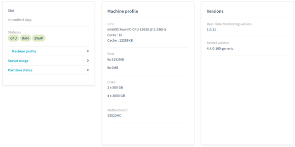
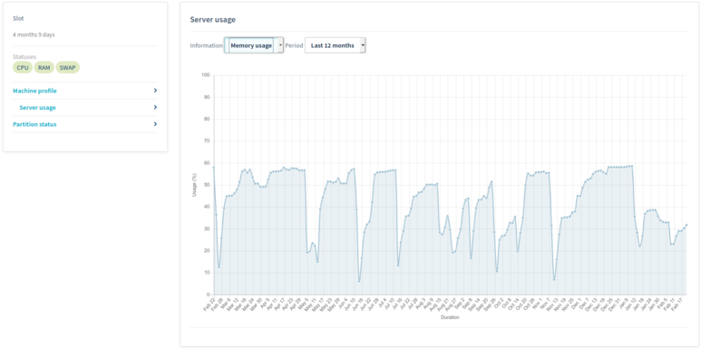
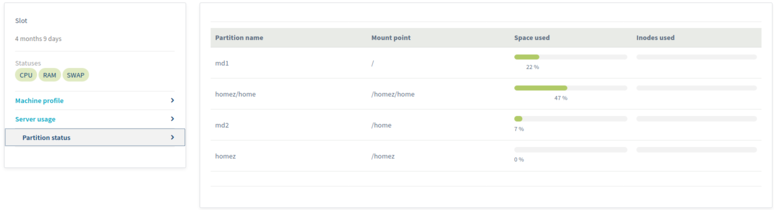
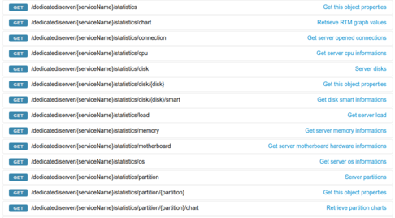
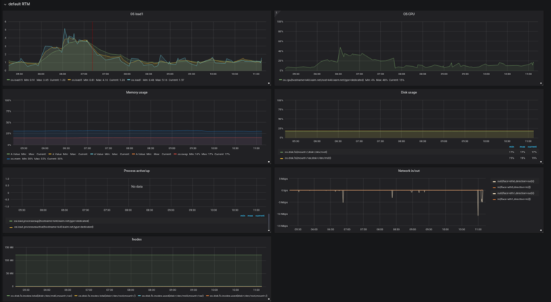

# OVH RTM
(OVH Real Time Monitoring probes)

This repository contain OVH RTM probes and packaging script.
It depends on the default implementation of the **ovh-rtm-metrics-toolkit package** and the additional tools **noderig** and **beamium**.

Real Time Monitoring is composed of 2 packages:

- **ovh-metrics-toolkit**: configure [beamium](https://github.com/ovh/beamium) and [noderig](https://github.com/ovh/noderig) to push monitoring metrics and probes result's to OVH monitoring platform.

- **ovh-rtm-binaries**: copies OVH monitoring probes into /usr/bin/rtm\*

For details about Noderig see the [main repository](https://github.com/ovh/noderig)

For details about Beamium see the [main repository](https://github.com/ovh/beamium)


By installing ovh-rtm-metrics-toolkit package you will be able to have a metrics based monitoring solution for your server.
(only working for baremetal and public cloud).
(public cloud users can only use [Insight](https://docs.ovh.com/fr/metrics/metrics-insight/) to retrieve their metrics)

1. Displayed on OVHCloud web manager:     

   







1. on API:



1. But you can also create your own Grafana monitoring dashboard to display metrics values in real time:
(recommended method)



How to proceed: [RTM on Grafana](rtm_grafana.md)

# How to install OVH RTM packages:
Please refer to OVH docs:
https://docs.ovh.com/gb/en/dedicated/install-rtm/

# Releases:
http://last.public.ovh.rtm.snap.mirrors.ovh.net/

# Status
OVH datacenters are composed of many type of servers, each running differents OSes with different components.
This monitoring solution try to be compatible with the most part of them and thus still currently under development.

Feel free to comment or contribute!


# What is collected ?

## RTM metrics

RTM collects real time monitoring data (based on noderig default collectors) on CPU, LOAD, RAM, DISK, NET.

## RTM probes

RTM probes are perl scripts. Results are mainly available on ovh API. 
Located in /usr/bin/rtm\*, they are launched at differents intervals.
It depends on which [noderig external collectors](https://github.com/ovh/noderig#collectors-1) folders they are linked. 
You can see links located in noderig external collector:
```
/opt/noderig/
├── 3600
│   ├── rtmHourly -> /usr/bin/rtmHourly
│   └── rtmRaidCheck -> /usr/bin/rtmRaidCheck
└── 43200
    └── rtmHardware -> /usr/bin/rtmHardware
```
Thoses scripts exposes monitoring results as prometheus format (https://github.com/prometheus/docs/blob/master/content/docs/instrumenting/exposition_formats.md).

### rtmHourly

This probe is executed each 3600s (1hour). It collects informations like the uptime, load average, memory usage, current rtm version installed,the top processes, open ports and the number of ongoing processes.

#### data exemple
```
{"metric":"rtm.info.rtm.version","timestamp":1582207693,"value":"1.0.11"}
{"metric":"rtm.info.uptime","timestamp":1582207693,"value":"11400912"}
{"metric":"rtm.hostname","timestamp":1582207693,"value":"ns10000"}

{"metric":"os.load.processesactive","timestamp":1582207693,"value":"1"}
{"metric":"os.load.processesup","timestamp":1582207693,"value":"650"}

{"metric":"rtm.info.mem.top_mem_1_name","timestamp":1582207693,"value":"/usr/bin/syncthing"}
{"metric":"rtm.info.mem.top_mem_1_size","timestamp":1582207693,"value":"4833764"}
{"metric":"rtm.info.mem.top_mem_2_name","timestamp":1582207693,"value":"/usr/bin/smbd"}
{"metric":"rtm.info.mem.top_mem_2_size","timestamp":1582207693,"value":"1871772"}
{"metric":"rtm.info.mem.top_mem_3_name","timestamp":1582207693,"value":"/usr/bin/smbd"}
{"metric":"rtm.info.mem.top_mem_3_size","timestamp":1582207693,"value":"1510164"}
{"metric":"rtm.info.mem.top_mem_4_name","timestamp":1582207693,"value":"/usr/sbin/named"}
{"metric":"rtm.info.mem.top_mem_4_size","timestamp":1582207693,"value":"1025712"}
{"metric":"rtm.info.mem.top_mem_5_name","timestamp":1582207693,"value":"/usr/sbin/rsyslogd"}
{"metric":"rtm.info.mem.top_mem_5_size","timestamp":1582207693,"value":"361880"}

{"metric":"rtm.info.tcp.listen.ip-0-0-0-0.port-79.uid","timestamp":1582207693,"value":"111"}
{"metric":"rtm.info.tcp.listen.ip-0-0-0-0.port-79.pid","timestamp":1582207693,"value":"4851"}
{"metric":"rtm.info.tcp.listen.ip-0-0-0-0.port-79.username","timestamp":1582207693,"value":"oco"}
{"metric":"rtm.info.tcp.listen.ip-0-0-0-0.port-79.exe","timestamp":1582207693,"value":"/usr/bin/perl"}
{"metric":"rtm.info.tcp.listen.ip-0-0-0-0.port-79.cmdline","timestamp":1582207693,"value":"perl"}
{"metric":"rtm.info.tcp.listen.ip-0-0-0-0.port-79.procname","timestamp":1582207693,"value":"perl"}
```

### rtmHardware

This probe is executed each 43200s (12h). It collects information on the hardware  such as the motherboard, PCI devices, disk health (S.M.A.R.T data), etc.
Also collects some information on the software, such as the kernel and BIOS version.

### data exemple
```
{"metric":"rtm.hw.mb.manufacture","timestamp":1582208062,"value":"Supermicro"}
{"metric":"rtm.hw.mb.name","timestamp":1582208062,"value":"X10SRi-F"}
{"metric":"rtm.hw.mb.serial","timestamp":1582208062,"value":"NM175S506822"}

{"metric":"rtm.info.bios_date","timestamp":1582208062,"value":"12/17/2015"}
{"metric":"rtm.info.bios_version","timestamp":1582208062,"value":"2.0"}
{"metric":"rtm.info.bios_vendor","timestamp":1582208062,"value":"American Megatrends Inc."}

{"metric":"rtm.info.release.os","timestamp":1582208062,"value":"Ubuntu 16.04 xenial"}
{"metric":"rtm.info.kernel.version","timestamp":1582208062,"value":"#193-Ubuntu SMP Tue Sep 17 17:42:52 UTC 2019"}
{"metric":"rtm.info.kernel.release","timestamp":1582208062,"value":"4.4.0-165-generic"}

{"metric":"rtm.hw.cpu.name","timestamp":1582208062,"value":"Intel(R) Xeon(R) CPU E5-1650 v4 @ 3.60GHz"}
{"metric":"rtm.hw.cpu.number","timestamp":1582208062,"value":"12"}
{"metric":"rtm.hw.cpu.cache","timestamp":1582208062,"value":"15360 KB"}
{"metric":"rtm.hw.cpu.mhz","timestamp":1582208062,"value":"1212.750"}

{"metric":"rtm.info.check.vm","timestamp":1582208062,"value":"False"}
{"metric":"rtm.info.check.oops","timestamp":1582208062,"value":"False"}

{"metric":"rtm.hw.mem.bank-P0-Node0-Channel0-Dimm1-DIMMA2","timestamp":1582208062,"value":"No Module Installed"}
{"metric":"rtm.hw.mem.bank-P0-Node0-Channel1-Dimm1-DIMMB2","timestamp":1582208062,"value":"No Module Installed"}
{"metric":"rtm.hw.mem.bank-P0-Node0-Channel2-Dimm0-DIMMC1","timestamp":1582208062,"value":"16384"}
{"metric":"rtm.hw.mem.bank-P0-Node0-Channel1-Dimm0-DIMMB1","timestamp":1582208062,"value":"16384"}
{"metric":"rtm.hw.mem.bank-P0-Node0-Channel2-Dimm1-DIMMC2","timestamp":1582208062,"value":"No Module Installed"}
{"metric":"rtm.hw.mem.bank-P0-Node0-Channel3-Dimm1-DIMMD2","timestamp":1582208062,"value":"No Module Installed"}
{"metric":"rtm.hw.mem.bank-P0-Node0-Channel3-Dimm0-DIMMD1","timestamp":1582208062,"value":"16384"}
{"metric":"rtm.hw.mem.bank-P0-Node0-Channel0-Dimm0-DIMMA1","timestamp":1582208062,"value":"16384"}

{"metric":"rtm.hw.lspci.pci.ff-15-2","timestamp":1582208062,"value":"8086:6fb6"}
....

{"metric":"rtm.info.hdd.sda.capacity","timestamp":1582208062,"value":"4.00 TB"}
{"metric":"rtm.info.hdd.sda.link_type","timestamp":1582208062,"value":"sata"}
{"metric":"rtm.info.hdd.sda.firmware","timestamp":1582208062,"value":"A5GNT920"}
{"metric":"rtm.info.hdd.sda.dmesg.io.errors","timestamp":1582208062,"value":"0"}
{"metric":"rtm.info.hdd.sda.disk_type","timestamp":1582208062,"value":"hdd"}
{"metric":"rtm.info.hdd.sda.iostat.busy","timestamp":1582208062,"value":"3.34"}
{"metric":"rtm.info.hdd.sda.model","timestamp":1582208062,"value":"HGST HUS726040ALA610"}
{"metric":"rtm.info.hdd.sda.serial","timestamp":1582208062,"value":"K3GDA42B"}
{"metric":"rtm.info.hdd.sda.temperature","timestamp":1582208062,"value":"37"}

{"metric":"rtm.info.hdd.sda.iostat.read.per.sec","timestamp":1582208062,"value":"5.11"}
{"metric":"rtm.info.hdd.sda.iostat.writekb.per.sec","timestamp":1582208062,"value":"108.74"}
{"metric":"rtm.info.hdd.sda.iostat.write.merged.per.sec","timestamp":1582208062,"value":"1.38"}
{"metric":"rtm.info.hdd.sda.iostat.write.avg.wait","timestamp":1582208062,"value":"5.39"}
{"metric":"rtm.info.hdd.sda.iostat.read.avg.wait","timestamp":1582208062,"value":"9.25"}
{"metric":"rtm.info.hdd.sda.iostat.read.merged.per.sec","timestamp":1582208062,"value":"0.01"}
{"metric":"rtm.info.hdd.sda.iostat.readkb.per.sec","timestamp":1582208062,"value":"616.81"}
{"metric":"rtm.info.hdd.sda.iostat.write.per.sec","timestamp":1582208062,"value":"3.19"}

{"metric":"rtm.info.hdd.sda.smart.highest-temperature","timestamp":1582208062,"value":"47"}
{"metric":"rtm.info.hdd.sda.smart.bytes-read","timestamp":1582208062,"value":"21596906627584"}
{"metric":"rtm.info.hdd.sda.smart.udma-crc-error","timestamp":1582208062,"value":"0"}
{"metric":"rtm.info.hdd.sda.smart.link-failures","timestamp":1582208062,"value":"0"}
{"metric":"rtm.info.hdd.sda.smart.temperature","timestamp":1582208062,"value":"37"}
{"metric":"rtm.info.hdd.sda.smart.offline-uncorrectable","timestamp":1582208062,"value":"0"}
{"metric":"rtm.info.hdd.sda.smart.percentage-used","timestamp":1582208062,"value":"0"}
{"metric":"rtm.info.hdd.sda.smart.realocated-event-count","timestamp":1582208062,"value":"0"}
{"metric":"rtm.info.hdd.sda.smart.reallocated-sector-count","timestamp":1582208062,"value":"0"}
{"metric":"rtm.info.hdd.sda.smart.reported-corrected","timestamp":1582208062,"value":"-1"}
{"metric":"rtm.info.hdd.sda.smart.power-cycles","timestamp":1582208062,"value":"23"}
{"metric":"rtm.info.hdd.sda.smart.power-on-hours","timestamp":1582208062,"value":"10521"}
{"metric":"rtm.info.hdd.sda.smart.global-health","timestamp":1582208062,"value":"1"}
{"metric":"rtm.info.hdd.sda.smart.logged-error-count","timestamp":1582208062,"value":"0"}
{"metric":"rtm.info.hdd.sda.smart.current-pending-sector","timestamp":1582208062,"value":"0"}
{"metric":"rtm.info.hdd.sda.smart.reported-uncorrect","timestamp":1582208062,"value":"0"}
{"metric":"rtm.info.hdd.sda.smart.lowest-temperature","timestamp":1582208062,"value":"19"}
{"metric":"rtm.info.hdd.sda.smart.bytes-written","timestamp":1582208062,"value":"10071769343488"}
{"metric":"rtm.info.hdd.sda.smart.time","timestamp":1582208062,"value":"0"}
{"metric":"rtm.info.hdd.sda.smart.command-timeout","timestamp":1582208062,"value":"-1"}
```

### rtmRaidCheck

This probe is executed each 3600s (1hour). It collects information on RAID health's (if available).
### data exemple
```
{"metric":"rtm.hw.scsiraid.unit.md3.vol0.capacity","timestamp":1582208405,"value":"24.4 GB"}
{"metric":"rtm.hw.scsiraid.unit.md3.vol0.phys","timestamp":1582208405,"value":"3"}
{"metric":"rtm.hw.scsiraid.unit.md3.vol0.type","timestamp":1582208405,"value":"raid1"}
{"metric":"rtm.hw.scsiraid.unit.md3.vol0.status","timestamp":1582208405,"value":"active"}
{"metric":"rtm.hw.scsiraid.unit.md3.vol0.flags","timestamp":1582208405,"value":"clean"}

{"metric":"rtm.hw.scsiraid.port.md3.vol0.sda3.capacity","timestamp":1582208405,"value":"24.4 GB"}
{"metric":"rtm.hw.scsiraid.port.md3.vol0.sda3.status","timestamp":1582208405,"value":"active"}
{"metric":"rtm.hw.scsiraid.port.md3.vol0.sda3.flags","timestamp":1582208405,"value":"sync"}
{"metric":"rtm.hw.scsiraid.port.md3.vol0.sdb3.capacity","timestamp":1582208405,"value":"24.4 GB"}
{"metric":"rtm.hw.scsiraid.port.md3.vol0.sdb3.status","timestamp":1582208405,"value":"active"}
{"metric":"rtm.hw.scsiraid.port.md3.vol0.sdb3.flags","timestamp":1582208405,"value":"sync"}
```


### nvidia_smi_stats

Only available with nvidia cards.
Collects information and metrics on nvidia hardware.

\*need nvidia-smi driver and application installed

# Contributing
Instructions on how to contribute to OVH RTM are available on the Contributing page.
