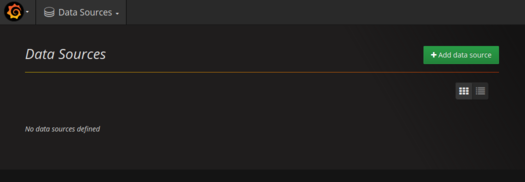
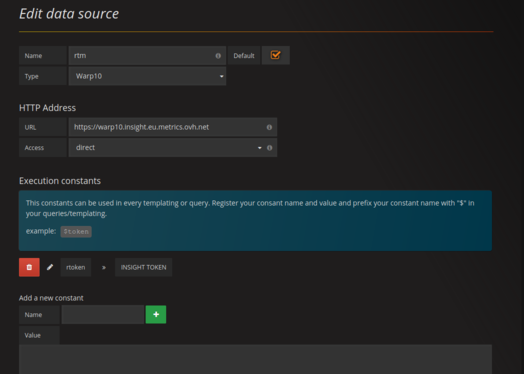
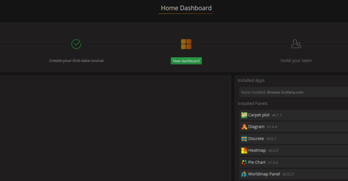
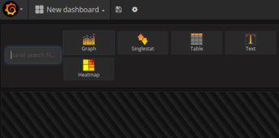
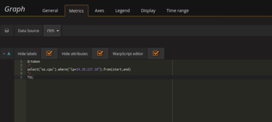

# RTM on grafana 

on OVH grafana public instance using Insight metrics token with TSL

More info on TSL: https://github.com/ovh/tsl 

## Retrieve your metric insight token

On OVH API, retrieve your insight token using this call:
 /me/insight 

More info on Insight : https://docs.ovh.com/gb/en/metrics/metrics-insight/ 

## Use OVH grafana public instance

Go on https://grafana.metrics.ovh.net/login and login with you OVH account

## Configure a data source



### add a Warp10 datasource

Select a warp10 type datasource.

TSL is not yet integrated as datasource, we will use it trough warp10 script.





URL datasource is : https://warp10.insight.eu.metrics.ovh.net 

Copy your insight Token as constant value with name "rtoken" (and don't forget to click on "+" button to add it)

## Create your first graph

### Create your dashboard



-Create new Visualization

select graph:



-Then edit the graph:

tick all the options "Hide labelds, Hide attribute and Warpscript10 editor".



Select WarpScript editor and copy paste this TSL query: 

```
$rtoken
<'
select("os.cpu").where("ip=YOUR SERVER IP").from(start,end)
'>
TSL
```

**metrics available are:**
* os.cpu
* os.swap
* os.mem
* os.net.bytes (both direction)
* os.load1
* os.load5
* os.load15
* os.load.processesup
* os.load.processesactive

for each disk:
* os.disk.fs
* os.disk.fs.used
* os.disk.fs.total
* os.disk.fs.inodes.used
* os.disk.fs.inodes.total


This is it , you can now graph your server metrics :D 


TODO: provide a complete template
